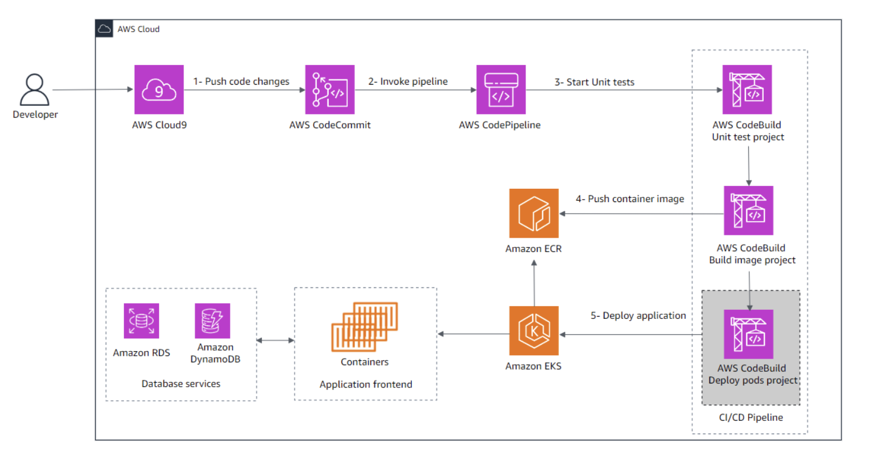

# Containerized Appointment Scheduler Application

## Project Overview
This projetc is a salon appointment scheduler that will allow customers to book appointments, select the stylist and select services. A senior developer developer pushed initial draft version of the application but didn't complete the application.

I was challenged to improve the web application and deploy it into a containerized environment through a continuous integration and continuous delivery (CI/CD) pipeline.

## Application's Main Features

### Customer Features
1. Appointment Booking
   - Schedule new appointments
   - Select preferred stylist
   - Choose from available service offerings
   - Pick convenient time slots
   - View available appointment times

### Scheduling System
1. Time Management
   - Real-time availability checking
   - Time slot management
   - Schedule conflict prevention
   - Appointment duration handling

### Service Management
1. Salon Services
   - List of available services
   - Service duration tracking
   - Service pricing information
   - Service categorization

### Stylist Management
1. Stylist Features
   - Stylist profiles
   - Individual stylist schedules
   - Stylist specialization/services
   - Availability management

## Architecture


### Image Description
Made updates to application code using an AWS supported IDE. I then push the code changes to a Git repository. This initiates a new CI/CD pipeline in AWS CodePipeline, which uses AWS CodeBuild to run unit tests and build the container image for the project. The image is pushed to Amazon ECR. After the image is pushed to Amazon ECR, the final step in the CI/CD pipeline deploys the project to the Amazon EKS cluster. The application frontend runs on containers, and the application is backed by two database services: Amazon Relational Database Service (Amazon RDS) and Amazon DynamoDB.

### System Components
- **Frontend**: Container-based web interface
- **Backend Services**: 
  - Amazon EKS for container orchestration
  - Amazon RDS for relational data storage
  - Amazon DynamoDB for NoSQL data storage
  
### CI/CD Pipeline
1. Developer pushes code to Git repository
2. AWS CodePipeline triggers the CI/CD process
3. AWS CodeBuild:
   - Runs unit tests
   - Builds container image
4. Container image is pushed to Amazon ECR
5. Deployment to Amazon EKS cluster

## Prerequisites
- AWS Account with appropriate permissions
- Docker installed locally
- kubectl CLI
- AWS CLI
- Git

### prerequisites files:
Located in the requirements.txt and requirements-dev.txt files

```bash
Django~=5.0.6
django-iam-dbauth~=0.1.4
mysqlclient~=2.2.4
boto3~=1.35.0
```
```bash
Django~=5.0.6
unittest-xml-reporting~=3.2.0
coverage~=7.5.1
pylint-django~=2.5.5
django-iam-dbauth~=0.1.4
mysqlclient~=2.2.4
boto3~=1.35.0
```

## Getting Started

### Local Development
1. Clone Repository
```bash
git clone INSERT_REPO_URL
```

2. Run Application
```bash
pip install -r appointments-app/requirements-dev.txt
```
3. Create SQLite database
```bash
python appointments-app/manage.py migrate
```

4. Start the Application
```bash
python appointments-app/manage.py runserver 0.0.0.0:8080
```
5. Add New Unit Test to tests.py

```bash

available_before = response.context["start_times_available_count"]
```
6. Verify Unit Test

```bash
. local_build.sh

```
### Database Setup

Use this code snippet to connect to the external Amazon RDS:
```bash
if ("DATABASE_HOST" in os.environ and 
   "DATABASE_USER" in os.environ and
   "DATABASE_DB_NAME" in os.environ):
    DATABASES = {
        "default": {
            "HOST": os.environ["DATABASE_HOST"],
            "USER": os.environ["DATABASE_USER"],
            "NAME": os.environ["DATABASE_DB_NAME"],
            "ENGINE": "django_iam_dbauth.aws.mysql",
            "OPTIONS": {
                'sql_mode': 'traditional',
                "use_iam_auth": True,
                "ssl_mode": "REQUIRED"
            }
        }
    }
```
### Deployment
1. Clone the repository
2. Configure AWS credentials
3. Build the container
4. Deploy to EKS


